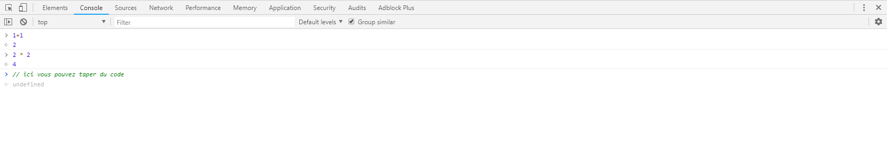

# Introduction à la programmation

## Un programme ? Qu'est-ce que c'est ?

Un programme est un morceau de texte appelé **code** ou **code source** qui dit ce que l'ordinateur doit faire.  

Réaliser un programme est simple mais sans la moindre attention, sa taille et sa complexité peuvent vite devenir incontrôlables ce qui déroutera même la personne qui l'a créée. Garder les programmes sous contrôle est le principal problème de la programmation. Lorsqu'un programme fonctionne, c'est magnifique. L'art de la programmation est la compétence de contrôler la complexité. **Un bon programme est maîtrisé, simplifié dans sa complexité.**

Habituellement, le code est sauvegardé dans des fichiers textes bien qu'avec JavaScript, vous pouvez également le taper directement dans la console développeur du navigateur :  tapez`CTRL + MAJ + I`et dans l'onglet `Console`, vous pouvez exécuter du JavaScript. 

